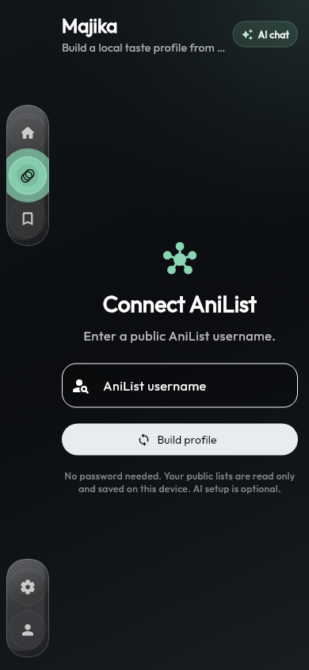
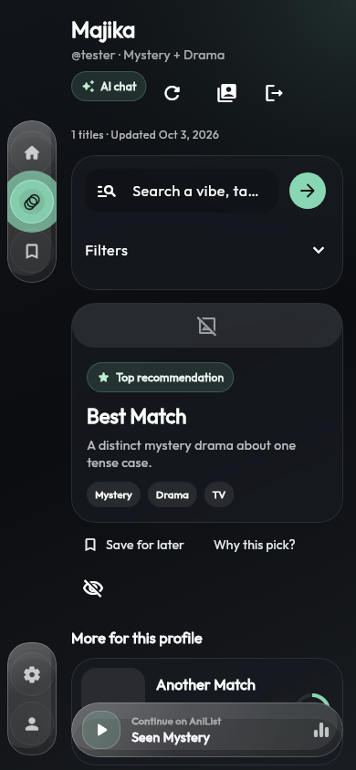
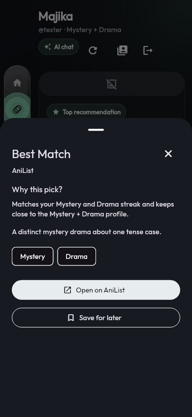
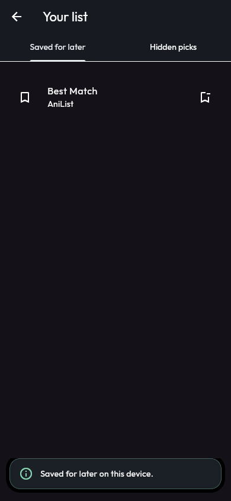
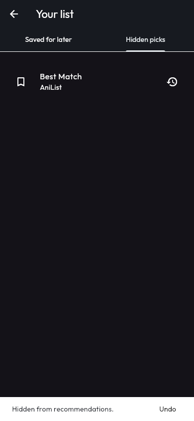
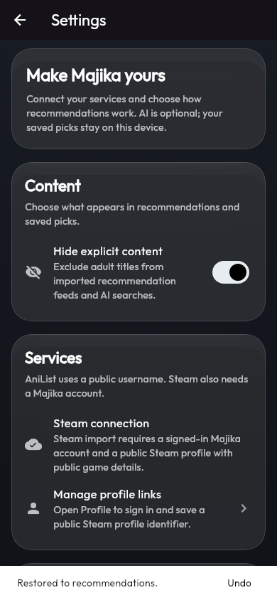
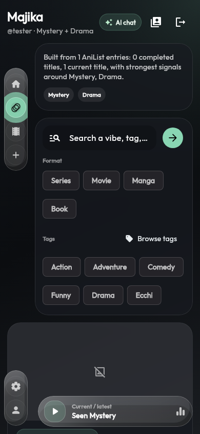
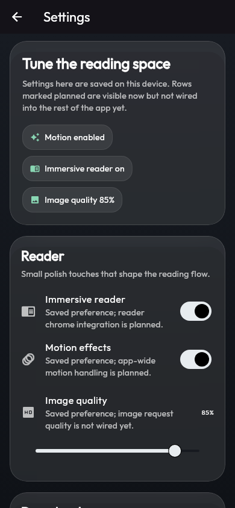
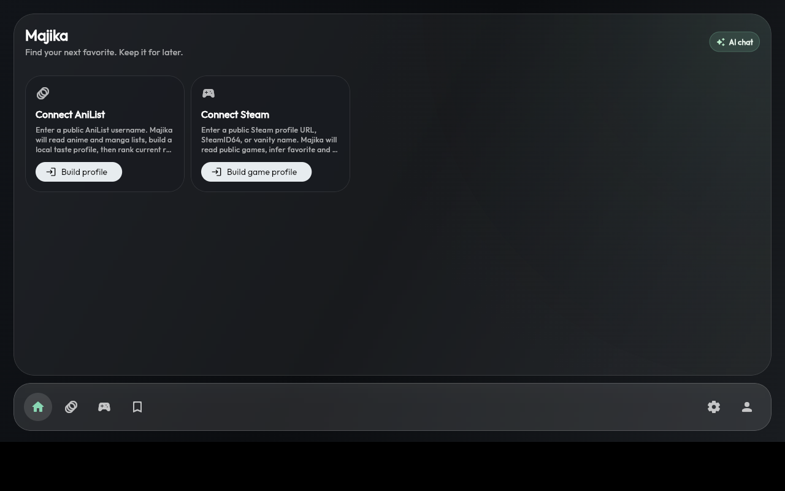

# Majika usability and reliability review — 2026-10-03

The main gap was the return visit: the feed offered recommendations but no way to keep a shortlist, hide unwanted picks, or refresh an imported library. On phones, filters pushed the first recommendation below the viewport and the navigation rail covered parts of the content. Settings led with controls whose behavior was not implemented.

This pass adds a complete discover → inspect → save → return loop and fixes the reliability failures found in the existing tests. It does not establish that every service, model, or device configuration is production ready.

## Captured flow

The phone screenshots below were rendered by Flutter's widget test engine at 390 × 844 with the existing Outfit font and Material icons. The flow uses a deterministic service fixture, with deliberately empty cover URLs, so it is reproducible without an account or network. These are actual widget renders, not mockups. Separately, the compiled Linux app was launched under an isolated X display and fresh application data directories.

1. **Connect — clearer.** The form explains public-list access and local storage instead of implementation plans. The initial Home screen only offers usable service connections. Import tolerates unavailable optional favorites/tags; library errors remain visible and retryable.

   

2. **Discover — improved and tested.** The rail has its own column, filters collapse on phones, the profile summary is compact, and the first recommendation appears much earlier. Refresh is available in the header. Search failures are visible with an imported profile; resetting a service search works from cached candidates. The latest-activity control opens the corresponding catalog page.

   

3. **Inspect — working.** “Why this pick?” opens the full explanation, description, tags, source link, and save action. External links validate their scheme and report launcher failures. Recommendation cards support keyboard activation.

   

4. **Save and return — working offline.** The saved list persists separately from imported profiles. Tests restart Home with a service that cannot fetch its library and verify saved items remain accessible without another import.

   

5. **Hide and restore — working.** Hiding removes a pick from the service and Home feeds. The action can be undone or reversed in Hidden picks. Saving a hidden title also restores it. Hidden decisions persist across restart.

   

6. **Settings — simplified and tested.** Unimplemented reader/download preferences and placeholder navigation were removed. Content and service setup are visible first; AI remains optional. Changing explicit-content visibility reapplies it to cached recommendations on return, and the saved list respects that setting.

   

## Before and after

The original phone feed placed a large filter panel before the main recommendation. The rail overlapped the cover area; the latest-activity bar looked like a player but had no action.



The original Settings screen led with reader, motion, and image-quality preferences that were saved but not implemented.



The compiled app opens successfully on Linux with a clean local profile:



## Reliability changes

- Serialized profile writes across store instances prevent simultaneous service saves from losing each other. A corrupt service record no longer discards healthy profiles.
- Saved-list updates serialize, report failed writes, and roll back their visible state on failure.
- An import revision prevents a late refresh from restoring a profile after sign-out. Canceled Home searches are checked before persisting results.
- Required library requests and optional metadata requests have bounded waits. AniList HTTP failures use readable messages, including rate limiting.
- Optional AI initialization cannot permanently prevent the local app from starting.
- Ranking accepts existing structured tag/description evidence when the request uses different wording, while preserving tests that reject generic matches for specific requests. No title, franchise, or creator mappings were added.
- Test expectations for inferred tags, cloud model labels, and condensed AI logs were corrected to match the implemented contracts.

## Verification and limits

- `flutter test --no-pub`: 184 tests passed, including new storage, offline restart, partial import, refresh retry, late-result, content-preference, and navigation tests.
- `flutter analyze --no-pub`: no issues.
- `flutter build linux --debug --no-pub`: successful. Native first launch rendered successfully with a fresh application data directory.
- Main flows checked at 320 × 568, 844 × 390, and 1280 × 800 with 1.8× text scaling. The saved-list empty state was made scrollable after these tests found overflow.
- The baseline had nine failing tests. One was stale generated shader data left from an older Flutter SDK; regenerating the test asset directory resolved the toolchain issue.
- Screenshots and widget tests do not establish screen-reader compliance, real-device touch behavior, or performance with large live libraries.
- Authenticated Steam/Firebase calls, real model inference/downloads, and Android/iOS builds were not exercised in this pass. Live catalog availability and recommendation relevance still need real-account testing.
- Saved and hidden lists are local to the device. Hidden picks are excluded from feeds, but are not yet used to retrain or adapt the taste model.

To recapture the phone flow, run:

```bash
flutter test --no-pub test/product_flows_test.dart \
  --plain-name 'phone connect, recommendations and settings flow' \
  --dart-define=CAPTURE_UI=true \
  --dart-define=CAPTURE_DIR=build/ux/after \
  --dart-define=CAPTURE_FONT=/absolute/path/to/Outfit-Regular.ttf
```

The font argument is optional for tests but recommended for readable screenshots. Captures load the installed Material icon asset. No live account data is used.
